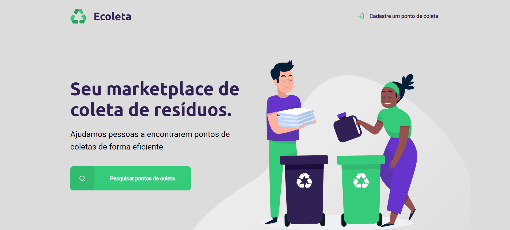

<h1 align="center">
    
    <br>
    <br>
    <a href="https://github.com/DicoMonteiro/NLW_Starter/src/server">NodeJS</a>
</h1>

<h4 align="center">
  It's an app for waste collection created during <a href="https://nextlevelweek.com/">Next Level Week #1</a>
  <br>
  Created with :purple_heart: by <a href="https://rocketseat.com.br/">Rocketseat</a>
</h4>

## :video_camera: Demonstration

#### Front-end

<h2 align="center">
  
</h2>

## :rocket: Technologies

#### Front-end

-  [Nodejs](https://nodejs.org/en/download/)
-  [Express](https://expressjs.com/pt-br/)
-  [Nodemon](https://nodemon.io/)
-  [Nunjucks](https://www.npmjs.com/package/nunjucks)
-  [SQLite](https://www.sqlite.org/)
-  [VS Code][vc]
-  [Extensão Nunjucks Template (VSCode)]

## :information_source: How To Use

To clone and run this application, you'll need [Git](https://git-scm.com), [Node.js v12.8][nodejs] or higher installed on your computer. From your command line:

```bash
# Clone this repository
$ git clone https://github.com/DicoMonteiro/NLW_Starter

# Install front-end dependencies
$ npm install

# Run the front-end app
$ npm start

```

## :memo: License
This project is under the MIT license. See the [LICENSE](https://github.com/DicoMonteiro/NLW_Starter/LICENSE) for more information.

---

Made with :purple_heart: by Adriano Almeida :wave: [Get in touch!](https://www.linkedin.com/in/adriano-barreto-monteiro-almeida/)

[nodejs]: https://nodejs.org/
[vc]: https://code.visualstudio.com/